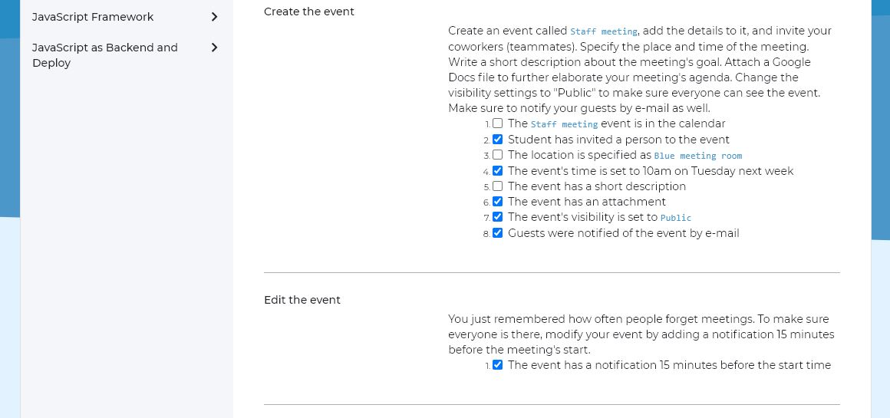

# Codecool curriculum project checklist
Chrome browser extension, that cooperate with the Codecool Journey curriculum projects page. Adds a checkbox to the checklist of parts of the project task. Here you can mark that you have completed the task.
The extension works completely independently of the Codecool Journey system.

## Prerequisites

Chrome browser
(I only tested the extension with Chrome version 86)

## Installing

1. Download the latest release from
   <https://github.com/marton-laszlo-attila/codecool-project-checklist/archive/main.zip>
1. Extract the zip file to any directory you'd like, though you need to make
   sure the directory is not deleted while you want to use the extension
1. Go to extensions page in Chrome (URL: `chrome://extensions`)
1. Enable developer mode if needed
1. Disable other existing instances of Codecool curriculum project checklist (from the store or
   from loading another unpacked version)
1. Click "Load Unpacked" and select the directory you extracted the release zip
   into
1. Check the list of extensions, to display the extensions icon in the icon list

## Using

After installing the extension, checkboxes will appear on the curriculum project pages. These can be checked, which is save by the extension.

There are two additional features available, which are displayed by clicking on the extension icon. There you can delete the markers of the current page or all pages. When you delete, the markings are also deleted from the database.

## Authors

* **Márton László Attila** - *Initial work* - [marton-laszlo-attila](https://github.com/marton-laszlo-attila)

## License

This project is licensed under the Apache License - see the [LICENSE.md](LICENSE.md) file for details
